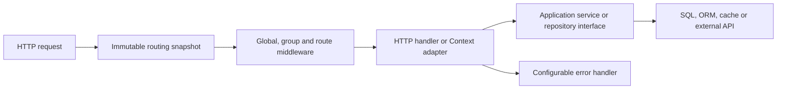

# Architecture and integration contracts

Jano's core owns HTTP routing and request/response adaptation. Applications own
domain validation, authentication rules, service lifecycles and persistence.



## Modules and design choices

| File/package | Responsibility |
| --- | --- |
| `jano.go` | Public router API, synchronization and snapshot publication. |
| `options.go` | Functional options for public configuration. |
| `router.go` | Exact-path index, segment trie, parameter extraction and 405 lookup. |
| `internal/routepattern` | Private pattern validation and structural metadata. |
| `group.go` | Prefix composition and middleware inheritance. |
| `context.go` | HTTP adaptation, JSON binding/rendering and response commitment tracking. |
| `params.go` | Native PathValue access and checked decimal conversion. |
| `errors.go` | Public HTTP errors and replaceable error policy. |
| `middleware` | Optional HTTP concerns, independent of persistence and domain models. |
| `examples/service` | Constructor injection and memory/SQL repository adapters. |

`New(options...)` uses functional options for opt-in behavior. Middleware forms a
chain of standard HTTP decorators. The Context adapter lets error-returning
handlers coexist with `http.Handler`. `ErrorHandler` is a replaceable error
strategy. Repository interfaces in applications invert the dependency on storage
and keep database details outside the router.

The router retains mutable configuration behind a lock and serves compiled,
immutable snapshots through an atomic pointer. It copies configuration before
invoking middleware factories, so application code is never invoked under the
configuration lock. A separate compilation lock prevents duplicate builds from
concurrent first requests. Configuration changes may invoke factories again, so
they must not depend on a single construction over the lifetime of the app.
Factories must only compose the supplied handler, never serve the router during
compilation. A request already in flight may use the previous snapshot after a
configuration change.

Exact static paths have a direct map lookup. Dynamic paths use a segment trie,
trying static, parameter and terminal catch-all branches in that order. Lookup
backtracks when a specific branch cannot finish matching. It does not scan every
registered route. Snapshot compilation has a startup/reconfiguration cost and is
excluded from lookup benchmarks. Route metadata is private so published snapshots
cannot be modified through the public API.

## Handler contracts

Standard handlers receive `http.ResponseWriter` and `*http.Request` unchanged for
static paths. Parameterized routes clone the request to prevent mutation of the
original request's path values. Parameters are visible before middleware runs.
Legacy string context keys are retained; prefer `jano.Param` or `r.PathValue` for
new code. For application context values, use private typed keys to avoid collisions.

`ParamInt` and `ParamInt64` build on PathValue, including values supplied by native
http.ServeMux. They reject missing values, malformed decimals and numeric overflow
without writing a response; returned HTTPError causes retain strconv errors for
errors.Is/As while the client message omits the raw input. Domain checks such as
positive IDs stay in the application. The numeric helpers add no route constraints
and do not change either router's URL decoding or method behavior.

Context handlers have the signature `func(*jano.Context) error`. Pass
`c.Context()` to downstream calls. Context helpers do not validate business rules.
`BindJSON` limits bodies to 1 MiB, rejects unknown fields and multiple values,
accepts JSON media types, and returns errors without writing a response. Override
the limit explicitly when appropriate. JSON is serialized before committing the
status so serialization failures reach the error policy.

An `HTTPError.Message` is deliberately public; do not put database details or
credentials in it. `HTTPError.Cause` supports `errors.Is`/`errors.As` and private
logging. Unexpected errors receive generic 500 JSON. Custom error handlers are
called even after commitment, allowing logging, but must not write another
response when `c.Written()` is true.

Response wrappers expose `Unwrap` for `http.ResponseController`, with tracked
flushing and hijacking. HTTP 101 and a successful hijack commit the response, so
error handlers and recovery cannot append an HTTP error after an upgrade. Hijack
returns `http.ErrNotSupported` when the underlying writer lacks that capability;
the caller owns the transferred connection and must close it. Context and recovery
wrappers do not preserve every legacy optional interface, such as `http.Flusher`;
use `http.ResponseController` or an integration adapter for those operations.
Do not retain a Context or use its response writer from concurrent goroutines.

## Middleware contracts

Global middleware wraps parent group middleware, then child group middleware,
then route middleware. Registration order defines nesting. Global additions
invalidate snapshots and affect already registered routes; group additions affect
future registrations only. Group settings and route registrations are synchronized.

Global middleware deliberately bypasses fallback and optional 405 responses for
legacy compatibility. Apply cross-cutting behavior to the entire handler when it
must cover every request:

```go
handler := middleware.Recovery(reportPanic)(middleware.RequestID(app))
server := &http.Server{Handler: handler}
```

`ContextTimeout` sets a request deadline and cancels its child context when the
handler returns. It cannot stop code that ignores context, and it does not send an
automatic timeout response. `BodyLimit` rejects excessive known Content-Length
values before the handler; for streamed bodies, handlers must translate
`*http.MaxBytesError` into an appropriate response. `Recovery` preserves committed
responses and propagates `http.ErrAbortHandler` to the server.

## Persistence boundaries

Inject a narrow, domain-specific interface through a constructor or closure:

```go
type UserRepository interface {
    Find(context.Context, int64) (User, error)
}

func userHandler(repository UserRepository) jano.HandlerFunc {
    return func(c *jano.Context) error {
        id, err := c.ParamInt64("id")
        if err != nil || id <= 0 {
            return jano.NewHTTPError(http.StatusBadRequest, "Invalid user ID")
        }
        user, err := repository.Find(c.Context(), id)
        if err != nil {
            return err
        }
        return c.JSON(http.StatusOK, user)
    }
}
```

Open the connection pool in the application's composition root, configure it,
inject the repository, and close it during shutdown. Keep transaction boundaries
in the service/repository layer. Translate storage errors such as `sql.ErrNoRows`
into domain errors, then map those to HTTP in the handler.

Context-aware adapters can use:

| Client | Context-aware operation | Reference |
| --- | --- | --- |
| `database/sql` | `db.QueryRowContext(ctx, query, args...).Scan(...)` | [Go SQL API](https://pkg.go.dev/database/sql#DB.QueryRowContext) |
| sqlx | `db.GetContext(ctx, &result, query, args...)` | [sqlx API](https://pkg.go.dev/github.com/jmoiron/sqlx#DB.GetContext) |
| GORM | `db.WithContext(ctx).First(&result, id).Error` | [GORM context documentation](https://gorm.io/docs/context.html) |

These are application integration patterns, not bundled drivers or verified
end-to-end ORM integrations. The compiled SQL adapter uses PostgreSQL placeholders;
its tests exercise `database/sql` through a local test driver. Real database
integration tests require the chosen driver, schema and database instance.

## Migration and next increments

Existing `Get`, `Post`, `Router`, `Use`, `NotFound` and legacy context parameter
calls remain usable. Existing tests continue to run. New now accepts variadic options; consumers that
stored it as `func() *Jano` should use a zero-argument wrapper. There are deliberate routing
changes: static/parameter precedence is now deterministic, `{name...}` has catch-all
semantics, and malformed or ambiguous patterns are rejected at registration.
Check any legacy routes that relied on undefined precedence or unusual names.

405 is opt-in; implicit HEAD/OPTIONS, redirect normalization, regexp constraints,
CORS, validation tags, file serving helpers and tracing exporters are not added in
this increment. Introduce each capability with its own compatibility contract,
security behavior, tests and benchmarks. This foundation does not establish feature
or performance parity with Gin; its public documentation provides useful comparison
points for [grouping](https://gin-gonic.com/en/docs/routing/grouping-routes/) and
[middleware scopes](https://gin-gonic.com/en/docs/middleware/using-middleware/).

## Server lifecycle

The service example waits for `http.Server.Shutdown` to finish after its listener
closes. An active request may still be finishing when `ListenAndServe` returns;
returning from main at that point would interrupt it. The example allows five
seconds for shutdown and forcibly closes remaining connections if the deadline
expires. Application code owns shutdown of database pools and hijacked connections.
See the [Go shutdown contract](https://pkg.go.dev/net/http#Server.Shutdown).

## Module layout

The public Jano package stays at the module root. Its primary file is `jano.go`,
with options, errors, context and groups in focused files in the same package.
Optional reusable middleware is a public subpackage. Pattern validation lives in
`internal/routepattern`, preventing unrelated modules from importing that supporting
API. Persistence adapters remain in examples because database ownership belongs
to the application.

This follows the [Go module organization guide](https://go.dev/doc/modules/layout),
which recommends root packages and internal supporting packages when appropriate.
File names are examples, not fixed requirements; a library has no executable
entry point, and `client.go` is not required for an HTTP router.
